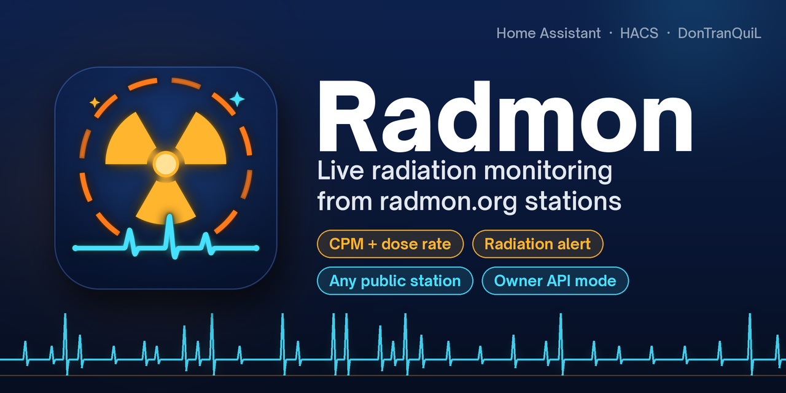

<div align="center">



<br>

**Background radiation from any [radmon.org](https://radmon.org) Geiger counter station in Home Assistant: CPM, µSv/h, an online check and a radiation alert.**

[](https://my.home-assistant.io/redirect/hacs_repository/?owner=DonTranQuiL&repository=HA-Radmon&category=integration)
[](https://my.home-assistant.io/redirect/config_flow_start/?domain=radmon_scrape)

[](https://github.com/DonTranQuiL/HA-Radmon/releases)
[](https://hacs.xyz)
[](https://www.home-assistant.io/)
[](LICENSE)

[](https://github.com/DonTranQuiL/HA-Radmon/actions/workflows/pytest.yml)
[](https://github.com/DonTranQuiL/HA-Radmon/actions/workflows/hass-ci.yml)
[](https://github.com/DonTranQuiL/HA-Radmon/actions/workflows/hassfest.yaml)
[](https://github.com/DonTranQuiL/HA-Radmon/actions/workflows/hacs.yaml)
[](https://github.com/DonTranQuiL/HA-Radmon/actions/workflows/codeql.yml)
[](https://github.com/astral-sh/ruff)
[](https://discord.gg/qaHPTTKHae)
[](https://ko-fi.com/DonTranQuiL)

[Install](#installation) · [Modes](#owner-mode-or-public-mode) · [Entities](#entities) · [Dashboard](#dashboard-example) · [Automations](#automation-examples) · [Upgrading from 1.x](#upgrading-from-1x) · [Docs site](https://dontranquil.github.io/HA-Radmon/)

</div>

## Highlights

| | |
| --- | --- |
| ☢️ **Any station** | Follow any of the hundreds of hobbyist Geiger counters on radmon.org, near you or anywhere in the world. |
| 🔑 **Owner mode** | Running your own counter? Add its data-sending password and Radmon uses radmon.org's official last-reading API, including your station's own µSv/h. |
| 📈 **CPM and µSv/h** | Counts per minute plus a dose rate, from the station or calculated with a conversion factor you can tune to your tube. |
| 🚨 **Radiation alert** | A safety binary sensor that turns on above a CPM threshold you choose. |
| 📡 **Online check** | A connectivity binary sensor that turns off when the station stops reporting. |
| 📍 **Location built in** | Coordinates, place name and counter model as attributes and on the device. |
| 🛟 **Keeps working** | A failed poll keeps the last good reading. Diagnostic sensors show poll health and the diagnostics download redacts your password. |
| 🤝 **Plays nice** | Conservative polling and an identifying User-Agent, so radmon.org stays happy. |
| 🇳🇱 **English and Dutch** | The UI is translated into both. |

> [!WARNING]
> Radmon is **not a safety device**. Readings come from volunteers' hardware over the internet and can be late, missing or wrong. Never rely on it to protect people. Follow your national authority's advice in an emergency.

## Installation

### HACS (recommended)

Click the **Open in HACS** button above, or add the repository yourself:

1. HACS → ⋮ → **Custom repositories**
2. URL: `https://github.com/DonTranQuiL/HA-Radmon`, category **Integration**
3. Download **Radmon**, then restart Home Assistant

### Manual

Copy `custom_components/radmon_scrape` to `/config/custom_components/` and restart Home Assistant.

## Configuration

**Settings → Devices & services → Add integration → Radmon**, or use the **Add integration** button above.

1. Enter the **station name** exactly as it appears in the [radmon.org station list](https://radmon.org/index.php/stations). It is case-sensitive, for example `lImbus`.
2. Your own station? Also enter its **data-sending password** (the one your counter uses to upload). Otherwise leave it empty.

Radmon checks the station (and password) with radmon.org before saving. Add the integration again for each extra station: every station gets its own device.

### Owner mode or public mode

| | Owner mode | Public mode |
| --- | --- | --- |
| For | Your own station | Any station |
| Needs | Station name + data-sending password | Station name |
| Source | Official `lastreading` / `lastreadingusv` API | Public station page (`showuserpage`) |
| Dose rate | Station's own µSv/h (calculated as a fallback) | Calculated from CPM |
| Default / minimum interval | 5 / 1 minutes | 30 / 15 minutes |

Since May 2026 radmon.org only answers the last-reading API with the station's data-sending password, so that API is for owners. Public mode reads the small public station page instead. radmon.org is a free, volunteer-run community service and has asked people not to hammer station pages, which is why the public interval is 30 minutes by default and can't go below 15.

Switch modes at any time: open the entry → ⋮ → **Reconfigure**.

### Options

Open the entry → **Configure**:

| Option | Default | What it does |
| --- | --- | --- |
| Update interval | 5 min (owner) / 30 min (public) | How often radmon.org is asked for a new reading. |
| Conversion factor | `0.0057` µSv/h per CPM | Used to calculate the dose rate. `0.0057` suits an SBM-20 tube. Check your tube's datasheet; for example the J305 is often quoted around `0.0081`. |
| Alert threshold | `100` CPM | The radiation alert turns on at or above this value. Normal background is roughly 10–50 CPM on an SBM-20. |
| Offline after | `30` min | The online sensor turns off when the latest reading is older than this. |

## Entities

For a station called `lImbus`, the device is **Radmon lImbus** with:

| Entity | Example ID | Description |
| --- | --- | --- |
| CPM | `sensor.radmon_limbus_cpm` | Counts per minute. Attributes: station, mode, location, latitude, longitude, device. |
| Dose rate | `sensor.radmon_limbus_dose_rate` | µSv/h. Attributes: `source` (`station` or `derived`) and `conversion_factor`. |
| Last reading | `sensor.radmon_limbus_last_reading` | When the station took the reading (timestamp). |
| Online | `binary_sensor.radmon_limbus_online` | On while readings are fresh (connectivity). Attributes: reading age and threshold. |
| Radiation alert | `binary_sensor.radmon_limbus_radiation_alert` | On at or above the alert threshold (safety). |
| Consecutive update errors | `sensor.radmon_limbus_consecutive_update_errors` | Diagnostic, disabled by default. |
| Last update status | `sensor.radmon_limbus_last_update_status` | Diagnostic, disabled by default. |
| Last update time | `sensor.radmon_limbus_last_update_time` | Diagnostic, disabled by default. |

CPM and dose rate have a measurement state class, so you get long-term statistics and history graphs for free.

## Dashboard example

```yaml
type: vertical-stack
cards:
  - type: entities
    title: Radiation
    entities:
      - entity: sensor.radmon_limbus_cpm
      - entity: sensor.radmon_limbus_dose_rate
      - entity: sensor.radmon_limbus_last_reading
        format: relative
      - entity: binary_sensor.radmon_limbus_online
      - entity: binary_sensor.radmon_limbus_radiation_alert
  - type: gauge
    entity: sensor.radmon_limbus_dose_rate
    name: Dose rate
    min: 0
    max: 1
    severity:
      green: 0
      yellow: 0.3
      red: 0.6
  - type: statistics-graph
    title: CPM, last 7 days
    entities:
      - sensor.radmon_limbus_cpm
    days_to_show: 7
    stat_types: [mean, max]
```

## Automation examples

Notify when the alert turns on:

```yaml
automation:
  - alias: Radmon radiation alert
    triggers:
      - trigger: state
        entity_id: binary_sensor.radmon_limbus_radiation_alert
        to: "on"
    actions:
      - action: notify.mobile_app_your_phone
        data:
          title: "☢️ Radiation alert"
          message: >
            {{ states('sensor.radmon_limbus_cpm') }} CPM
            ({{ states('sensor.radmon_limbus_dose_rate') }} µSv/h) at station lImbus.
            Check radmon.org and official sources before acting.
```

Tell me when my own counter stops uploading:

```yaml
automation:
  - alias: Radmon station offline
    triggers:
      - trigger: state
        entity_id: binary_sensor.radmon_limbus_online
        to: "off"
        for: "00:30:00"
    actions:
      - action: notify.mobile_app_your_phone
        data:
          message: "My Geiger counter hasn't reported to radmon.org for an hour."
```

## Upgrading from 1.x

Version 2.0 is a full rewrite, and existing setups upgrade in place:

- The domain stays `radmon_scrape`, so your entry is **migrated automatically** to public mode with a 30-minute interval.
- Unique IDs are unchanged, so the CPM and dose rate entities keep their IDs, history and dashboard cards.
- **Delete the old `custom_components/ha-radmon` folder** after updating. The new code lives in `custom_components/radmon_scrape`, and if both folders exist Home Assistant may load the old one.
- The device is now named **Radmon &lt;station&gt;**.
- Want owner mode? Entry → ⋮ → **Reconfigure** → enter the data-sending password.

See the [changelog](CHANGELOG.md) for everything that changed.

## How it works

| Mode | Request | Example answer |
| --- | --- | --- |
| Owner | `radmon.php?function=lastreading&user=…&password=…` | `18 CPM on 2022-12-03 17:49:31UTC at Blackpool, …` |
| Owner | `radmon.php?function=lastreadingusv&user=…&password=…` | `0.225 uSv/hr on …` |
| Public | `radmon.php?function=showuserpage&user=…` | Small HTML page with the latest CPM, time, coordinates and counter model |

Owner mode also loads the station page once a day for location metadata. Radmon never downloads the full station list or graphs, which radmon.org restricts.

A daily [API watcher](.github/workflows/ai-feed-watcher.yml) checks that these endpoints still answer as documented and opens an issue if they change.

## Troubleshooting

| Problem | Fix |
| --- | --- |
| *Station not found* | Names are case-sensitive. Copy the name from the [station list](https://radmon.org/index.php/stations). |
| *Invalid password* | Use the **data-sending** password your counter uploads with, not your forum login. |
| Asked to re-authenticate | radmon.org rejected the password, for example because you changed it. Enter the new one. |
| Online is off | The station hasn't reported within the *Offline after* window. Check its page on radmon.org. |
| Dose rate looks off | In public mode it's calculated. Set the conversion factor for the station's tube. |
| Sensors not updating | Enable the diagnostic sensors and check the last update status, then download diagnostics from the entry. |

For debug logs, add this to `configuration.yaml`:

```yaml
logger:
  logs:
    custom_components.radmon_scrape: debug
```

## Credits

- Data from [radmon.org](https://radmon.org), run by volunteers (thanks to Simomax and mw0uzo for the service and its API) and fed by its community of station owners
- Original 1.x integration by TranQuiL ([@Malosaaa](https://github.com/Malosaaa))
- Built and maintained by [DonTranQuiL](https://github.com/DonTranQuiL)

radmon.org is free and costs its volunteers money to run. If you use it a lot, consider [supporting it](https://radmon.org).

## Disclaimer

Unofficial. Not affiliated with radmon.org. Radmon is not a safety device and its readings must not be used to protect health or life.

## Support

- Docs: [dontranquil.github.io/HA-Radmon](https://dontranquil.github.io/HA-Radmon/)
- Issues: [GitHub Issues](https://github.com/DonTranQuiL/HA-Radmon/issues)
- Community: [Discord](https://discord.gg/qaHPTTKHae)
- Tip jar: [Ko-fi](https://ko-fi.com/DonTranQuiL)

## License

MIT, see [LICENSE](LICENSE).
